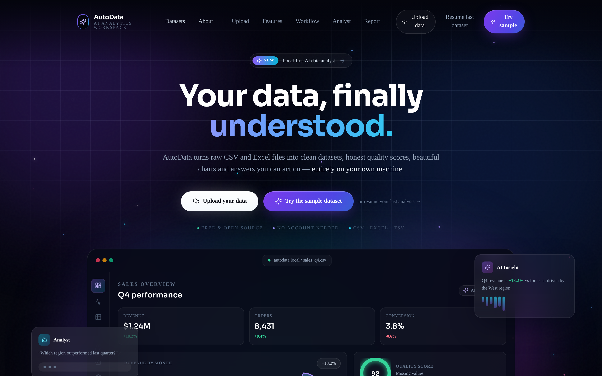
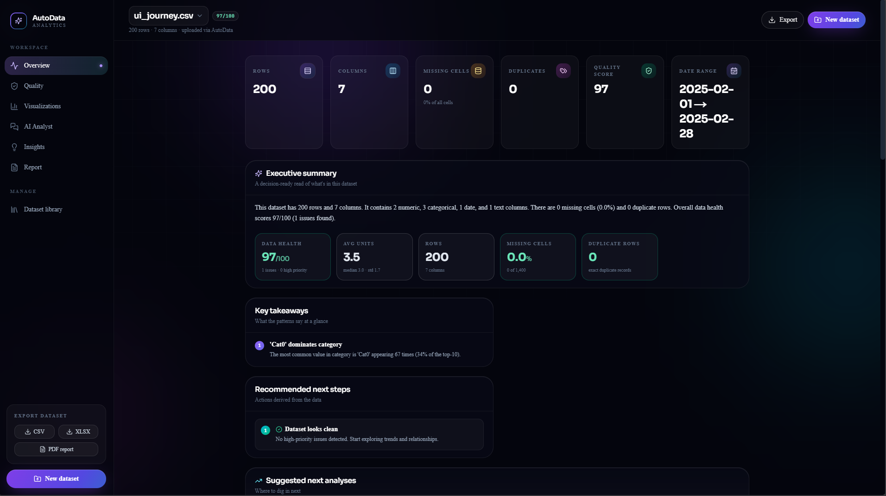
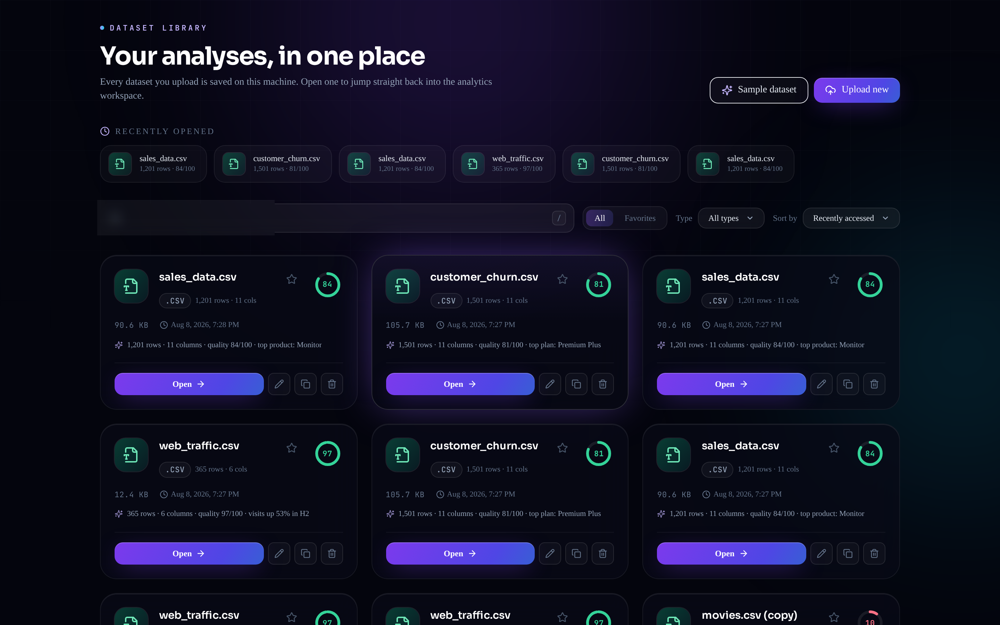
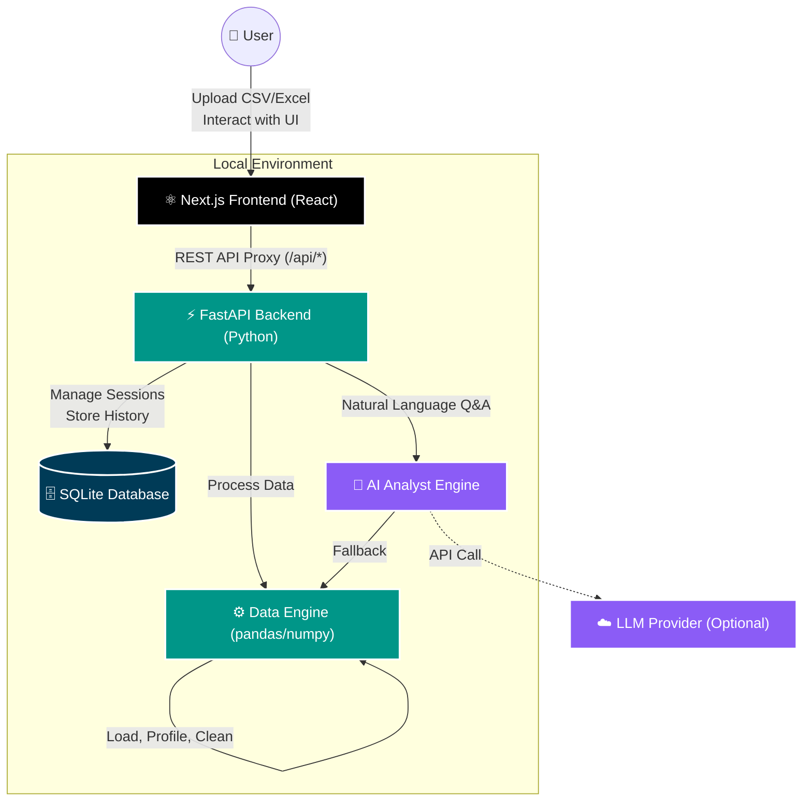

<p align="center">
  
</p>

<p align="center">
  <strong>AutoData</strong> — your local AI data analyst. Upload a CSV or Excel file and get instant data profiling, quality checks, guided cleaning, interactive visualizations, natural-language Q&A, AI insights, export, and a downloadable PDF report — all on your own machine.
</p>

<p align="center">
  <a href="#features"></a>
  <a href="#quick-start"></a>
  <a href="#deploy-to-render-free"></a>
  <a href="#tests"></a>
  <a href="#privacy-note"></a>
  <br/><br/>
  
  
  
  
  
  
  
  
  
  <br/><br/>
  <a href="#contributing-and-vibe-coding-✨"></a>
  <a href="https://github.com/JayanGupta/AutoData/stargazers"></a>
</p>

<p align="center">
  
</p>

---

## 📸 Screenshots

<p align="center">
  
  <br/>
  <em>Landing page with live dashboard preview</em>
</p>

<p align="center">
  
  <br/>
  <em>Feature highlights and workflow</em>
</p>

<p align="center">
  
  <br/>
  <em>Dataset library with search, filters, and sample data</em>
</p>

## 🚀 Why AutoData

Most data-analysis tools are either black-box SaaS (your data leaves your machine) or require you to string together a dozen notebooks and scripts. AutoData sits in the middle: a self-contained, run-anywhere pipeline that takes a raw file and walks it through a complete analysis workflow — automatically, with no code, and with every number grounded in your actual data.

## ✨ Features

- 📥 **Upload anything** — CSV / TSV / Excel (`.xlsx` & `.xls`), up to 50 MB, with automatic encoding & delimiter sniffing and async background jobs for large files
- 🔍 **Auto-profiling** — column type inference, distributions, summary statistics, semantic hints, and PII / sensitive-column detection
- 🩺 **Data quality** — missing values, duplicates, outliers, type anomalies, constant/empty columns, and skew, rolled into a 0–100 quality score
- 🧹 **Cleaning studio** — guided column operations (fill missing, convert numeric, trim, lowercase, parse dates, rename, drop) plus one-click quick fixes; every step is tracked and fully undoable
- 📊 **Visualizations** — auto-generated histograms, time series, bar/pie breakdowns, scatter plots, correlation heatmaps, plus an advanced library: box plots, violin plots, Q-Q plots, distributions, parallel coordinates, seasonal decomposition, treemaps, sunbursts, radar, bubble and pair plots
- 🗂️ **Dataset library** — every upload is saved locally with search, sort, favorites, file-type filters, rename, duplicate, delete, and an AI-generated one-line summary; three curated sample datasets for instant exploration
- 💬 **AI Analyst chat** — ask questions in plain English; answers are grounded in the actual dataset (never invented)
- 🧠 **AI insights** — deterministic pattern detection (correlations, trends, top performers, outliers), each linked to its chart evidence
- 📤 **Export & report** — download the cleaned dataset as CSV or XLSX, or generate a shareable report in Markdown, HTML, or PDF

## 🛠️ Quick start

Requirements: Python 3.11+, Node 18+, or Docker.

**Using Docker Compose (Recommended)**
```bash
docker-compose up --build
```
Open **http://localhost:3000** in your browser.

**Using Make (Local Development)**
```bash
make setup
make dev
```
Open **http://localhost:3000** in your browser.

### Environment Variables

Copy `backend/.env.example` to `backend/.env` and configure your credentials if you want to unlock AI capabilities. 

| Variable | Description | Default / Example |
| :--- | :--- | :--- |
| `USER_LLM_API_KEY` | Your API key for the LLM provider. | `sk-...` |
| `USER_LLM_BASE_URL` | The base URL for the OpenAI-compatible API. | `https://api.deepseek.com/v1` |
| `USER_LLM_MODEL` | The specific model to use for AI Q&A. | `deepseek-chat` |
| `AUTODATA_DATA_DIR` | (Optional) Path for durable storage. | `/opt/data` (on Render) |

> [!NOTE]
> **No API Key? No problem.** AutoData will gracefully fall back to **local rule-based mode**. The AI Analyst will still answer questions and generate insights completely locally using deterministic statistical rules.

## 🏗️ Architecture



## ☁️ Deploy to Render (free)

Push this repo to GitHub, then on Render: **New → Blueprint**, pick the repo.
The `render.yaml` at the repo root defines two **free** web services — no credit
card required:

| Service | Runtime | What it runs |
| --- | --- | --- |
| `autodata-backend` | Python 3.11 | FastAPI + pandas on `$PORT`, health check `/api/health` |
| `autodata-frontend` | Node 20 | Next.js `next start`, proxies every `/api/*` request to the backend via `BACKEND_URL` |

Open the frontend's `*.onrender.com` URL — the browser only ever talks to the
frontend, which reverse-proxies `/api` to the backend, so no CORS setup is
needed.

## 🧪 Tests

```bash
make test
```

## 🤝 Contributing and Vibe Coding ✨

**We love contributions!** Whether you're a seasoned developer, a data scientist, or someone who loves "vibe coding" with AI tools like GitHub Copilot or Cursor, you are incredibly welcome here.

How you can contribute:
*   **Vibe Coding 🤖**: Drop this repository into Cursor, Claude, or your favorite AI IDE, and start chatting to build features! We encourage AI-assisted contributions.
*   **Code 💻**: Found a bug? Have a feature idea? Open a PR! The `Makefile` and `docker-compose.yml` make it super easy to spin up the dev environment.
*   **Ideas & Feedback 💡**: Open an Issue or start a Discussion. We want to hear how you use AutoData.
*   **Spread the word 🌟**: If you like what we're building, give us a **Star**! It helps the project grow.

Don't worry if your code isn't perfect. We are happy to help you get your PR across the finish line! 

## 🔒 Privacy note

Datasets are stored locally in a SQLite database under `backend/app/data/` and never leave your machine. Nothing is uploaded to a cloud. When no LLM key is configured, all analysis is computed locally with deterministic rules.

---

<p align="center">
  Built with ❤️ using FastAPI & Next.js by Jayan Gupta.
</p>