<p align="center">
  
</p>

<p align="center">
  <strong>AutoData</strong> — your local AI data analyst. Upload a CSV or Excel file and get instant data profiling, quality checks, guided cleaning, interactive visualizations, natural-language Q&A, AI insights, export, and a downloadable PDF report — all on your own machine.
</p>

<p align="center">
  <a href="#features"></a>
  <a href="#quick-start"></a>
  <a href="#deploy-to-render-free"></a>
  <a href="#tests"></a>
  <a href="#privacy-note"></a>
  <br/>
  
  
  
  
  
  
  
  
  
  <br/>
  
</p>

---

## Why AutoData

Most data-analysis tools are either black-box SaaS (your data leaves your machine) or require you to string together a dozen notebooks and scripts. AutoData sits in the middle: a self-contained, run-anywhere pipeline that takes a raw file and walks it through a complete analysis workflow — automatically, with no code, and with every number grounded in your actual data.

## Features

- 📥 **Upload anything** — CSV / TSV / Excel (`.xlsx` & `.xls`), up to 50 MB, with automatic encoding & delimiter sniffing and async background jobs for large files
- 🔍 **Auto-profiling** — column type inference, distributions, summary statistics, semantic hints, and PII / sensitive-column detection
- 🩺 **Data quality** — missing values, duplicates, outliers, type anomalies, constant/empty columns, and skew, rolled into a 0–100 quality score
- 🧹 **Cleaning studio** — guided column operations (fill missing, convert numeric, trim, lowercase, parse dates, rename, drop) plus one-click quick fixes; every step is tracked and fully undoable
- 📊 **Visualizations** — auto-generated histograms, time series, bar/pie breakdowns, scatter plots, correlation heatmaps, plus an advanced library: box plots, violin plots, Q-Q plots, distributions, parallel coordinates, seasonal decomposition, treemaps, sunbursts, radar, bubble and pair plots
- 🗂️ **Dataset library** — every upload is saved locally with search, sort, favorites, file-type filters, rename, duplicate, delete, and an AI-generated one-line summary; three curated sample datasets for instant exploration
- 💬 **AI Analyst chat** — ask questions in plain English; answers are grounded in the actual dataset (never invented)
- 🧠 **AI insights** — deterministic pattern detection (correlations, trends, top performers, outliers), each linked to its chart evidence
- 📤 **Export & report** — download the cleaned dataset as CSV or XLSX, or generate a shareable report in Markdown, HTML, or PDF

## Quick start

Requirements: Python 3.11+, Node 18+.

```bash
# one command — installs deps and starts both servers
./start.sh
```

Or start them yourself:

**1. Backend** (http://localhost:8000)

```bash
cd backend
pip install -r requirements.txt
python -m uvicorn app.main:app --reload --port 8000
```

**2. Frontend** (http://localhost:5173, in a second terminal)

```bash
cd frontend
npm install
npm run dev -- -p 5173
```

Open **http://localhost:5173** — the Next.js dev server reverse-proxies every `/api/*` request to the backend on port 8000, so there is no CORS setup to do.

### Optional: enable the LLM

Copy `backend/.env.example` to `backend/.env` and fill in your own credentials:

```bash
cp backend/.env.example backend/.env
# USER_LLM_API_KEY=...
# USER_LLM_BASE_URL=https://api.deepseek.com/v1
# USER_LLM_MODEL=deepseek-chat
```

No key? No problem. AutoData runs in **local rule-based mode** — the AI analyst still answers questions and generates insights purely from computed statistics.

## Tech stack

| Layer | Tech |
| --- | --- |
| Frontend | React 18, TypeScript, Next.js 14, Tailwind CSS, Recharts |
| Backend | Python 3.11, FastAPI, pandas, numpy, reportlab |
| Storage | SQLite (sessions + conversation history) with CSV/JSON persistence — portable, no pickling |
| AI | Optional OpenAI-compatible LLM (SQL generation + interpretation); fully functional **local rule-based mode** without a key |

## Architecture

```
frontend/            Next.js app (port 5173) — reverse-proxies /api → backend
backend/             FastAPI app (port 8000)
  app/
    data_engine/     loader → profiler → quality → analysis → charts → cleaning
    ai/              insights, nlu (LLM or local), sql_runner, llm_client, local_analyst
    sessions/        SQLite-backed session store
    data_store/      persistence (SQLite: sessions, history, conversation)
    main.py          REST API (job runner, export, report, cleaning history, rate limiting)
  tests/             stdlib unittest suite (unit + API integration)
sample_data/         curated sample datasets (sales, customer churn, web traffic)
```

## Deploy to Render (free)

Push this repo to GitHub, then on Render: **New → Blueprint**, pick the repo.
The `render.yaml` at the repo root defines two **free** web services — no credit
card required:

| Service | Runtime | What it runs |
| --- | --- | --- |
| `autodata-backend` | Python 3.11 | FastAPI + pandas on `$PORT`, health check `/api/health` |
| `autodata-frontend` | Node 20 | Next.js `next start`, proxies every `/api/*` request to the backend via `BACKEND_URL` |

Open the frontend's `*.onrender.com` URL — the browser only ever talks to the
frontend, which reverse-proxies `/api` to the backend, so no CORS setup is
needed.

Free-tier caveats to know:

- **Cold start** — the first request after ~15 min idle takes ~1 minute while Render boots the service.
- **Ephemeral storage** — uploaded datasets / sessions are lost when a free service spins down or redeploys. For durable storage, upgrade to a paid instance and attach a disk at `/opt/data` (set `AUTODATA_DATA_DIR` in the backend env — it's already wired up in code).
- **Always-on** — switch both services to a paid instance type if you need zero idle spin-down.
- **LLM** — add your own `USER_LLM_API_KEY` to the backend service env vars to enable AI answers; otherwise the app runs in local rule-based mode.

## API overview

| Method | Endpoint | Purpose |
| --- | --- | --- |
| `POST` | `/api/jobs/upload` | Upload file → returns a job id (async background analysis) |
| `GET` | `/api/jobs/{id}` | Poll job status / progress |
| `POST` | `/api/datasets` | Upload file → full analysis snapshot (sync) |
| `GET` | `/api/datasets` | List saved sessions |
| `GET` | `/api/datasets/{id}` | Fetch snapshot (overview, quality, charts) |
| `POST` | `/api/datasets/sample?name=` | Load a bundled sample dataset |
| `GET` | `/api/samples` | List the sample dataset catalog |
| `GET` | `/api/datasets/{id}/rows` | Paginated raw rows |
| `GET` | `/api/datasets/{id}/export?fmt=csv\|xlsx` | Download the cleaned dataset |
| `POST` | `/api/datasets/{id}/clean` | Apply a cleaning step |
| `POST` | `/api/datasets/{id}/clean/undo` | Undo the last cleaning step |
| `GET` | `/api/datasets/{id}/cleaning` | Cleaning history |
| `GET` | `/api/datasets/{id}/insights` | Auto-generated insights |
| `POST` | `/api/datasets/{id}/insights/generate` | Re-run insight generation |
| `GET` | `/api/datasets/{id}/suggested-questions` | Suggested analyst questions |
| `POST` | `/api/datasets/{id}/ask` | Natural-language question |
| `GET` | `/api/datasets/{id}/report?fmt=markdown\|html\|pdf` | Report (markdown, html or pdf) |
| `GET` | `/api/llm/status` | LLM availability |

## Tests

```bash
cd backend
python -m unittest tests.test_engine tests.test_features tests.test_api -v
```

## Try it with sample data

Three curated sample datasets ship in `sample_data/`, generated by `generate_samples.py`:

- `sales_data.csv` — 1,201 retail orders with revenue, regions, channels and product categories, including deliberately injected quality issues to explore
- `customer_churn.csv` — 1,501 telecom customers with plans, contracts, usage and churn outcomes
- `web_traffic.csv` — 365 days of marketing metrics with a clear trend and weekly seasonality

Load any of them from the landing page or the Dataset library, then open a card to enter the analytics workspace.

## Privacy note

Datasets are stored locally in a SQLite database under `backend/app/data/` and never leave your machine. Nothing is uploaded to a cloud. When no LLM key is configured, all analysis is computed locally with deterministic rules.

---

<p align="center">
  Built with FastAPI & Next.js. Questions, ideas, and pull requests are welcome.
</p>
